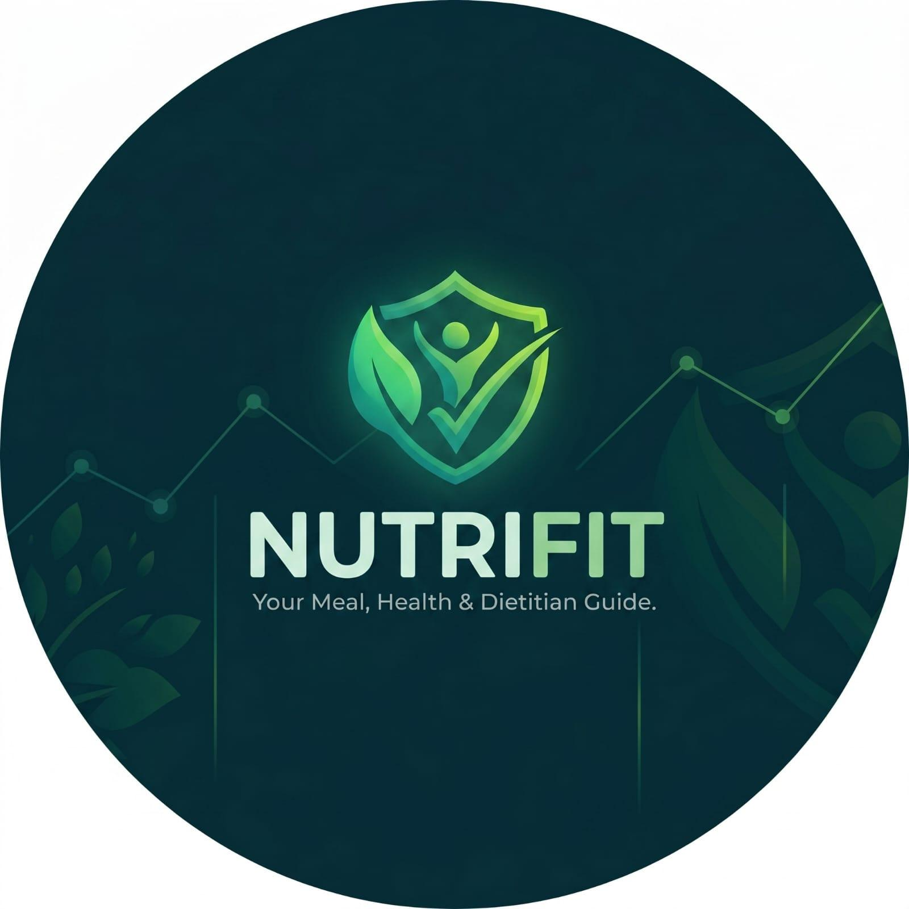

# NutriFit AI

> **Your Meal, Health & Dietitian Guide.**
> A production-grade full-stack web application combining Gemini-powered meal image analysis, a LangChain RAG chatbot for diet & disease nutrition, an AI-summarized local dietician marketplace, and an MCP-enabled activity tracker with daily personalized AI plans.

<p align="center"></p>

---

## ✨ Features

| Feature | Description |
|---|---|
| 🍽️ **Meal Image Analysis** | Upload any plate; Gemini Vision identifies foods, estimates portions, computes 6 macros + 10 micros, gives 3 wins / 3 cautions, and a 0–10 health score. |
| 🧠 **RAG Diet & Disease Chat** | LangChain + Pinecone over a curated knowledge base (Mediterranean, DASH, keto, Indian balanced, diabetes, PCOS, hypertension, kidney disease, …). Attach an image of a condition for image-aware retrieval. |
| 👩‍⚕️ **Local Dieticians + AI Summaries** | Register/list/book dieticians, upload the call recording, AI transcribes (Gemini or Whisper) and writes a structured summary you can question later. |
| 🏋️ **MCP Activity Logging** | Drop-in MCP server with 4 tools (`log_exercise`, `log_food_intake`, `log_walk`, `log_custom_activity`) that write to `activity_logs` with `logged_via='mcp'`. Manual logging is also available. |
| ✨ **Daily Personalized Plans** | Dashboard pulls your last 7–30 days of logs and generates today's diet plan, today's workout plan, and 3-5 trend insights via Gemini. |
| 🔐 **Auth + Validation** | JWT auth (python-jose + passlib bcrypt), strong password policy enforced both client and server side. |

---

## 🧱 Tech Stack

- **Backend:** FastAPI · SQLAlchemy 2 · PostgreSQL
- **AI:** Google Gemini (1.5 Pro + Flash) via `google-generativeai`
- **RAG:** LangChain · Pinecone (serverless) · Google Generative AI Embeddings
- **Frontend:** Flask · Jinja2 · vanilla JS · Chart.js · Font Awesome
- **Auth:** JWT (HS256) · bcrypt
- **Storage:** Local filesystem (`uploads/`)
- **MCP:** Python module with framework-agnostic handlers (FastMCP example included)

---

## 📁 Project Structure

```
letsgo/
├── backend/
│   ├── main.py                  # FastAPI entry point
│   ├── config.py                # Env vars, DB URL, API keys
│   ├── database.py              # SQLAlchemy session + Base
│   ├── models/                  # ORM models
│   ├── schemas/                 # Pydantic schemas
│   ├── routers/                 # auth · meal · rag_chat · dietician · activity · dashboard
│   ├── services/                # gemini · rag · meal_analysis · transcription · suggestion · prompts
│   ├── mcp/mcp_server.py        # MCP integration (replace with your own transport)
│   └── utils/                   # auth_utils · file_utils
├── frontend/
│   ├── app.py                   # Flask app
│   ├── templates/               # Jinja2 pages
│   └── static/css|js|img        # Design system + main.js + logo
├── rag_data/                    # Knowledge base text files (extend freely)
├── uploads/                     # Meal images, recordings, disease images (created at runtime)
├── init_db.py                   # Create tables + seed dieticians
├── seed_rag.py                  # Embed rag_data/ and upsert into Pinecone
├── requirements.txt
├── .env.example
└── README.md
```

---

## 🚀 Setup & Run

### 1. Prerequisites

- Python 3.11+
- PostgreSQL 14+ running locally
- A Google Gemini API key
- A Pinecone API key (free tier works — sign up at pinecone.io)
- `uv` (recommended) or `pip`

### 2. Clone & create virtual environment

```bash
cd /Users/ayush.jha/major_project/letsgo

# create venv with uv (already prepared in .venv/)
uv venv --python 3.11 .venv
source .venv/bin/activate

# install dependencies
uv pip install -r requirements.txt
```

### 3. Configure environment

```bash
cp .env.example .env
# then edit .env — set GEMINI_API_KEY, DATABASE_URL, SECRET_KEY
```

### 4. Create the database

```bash
createdb nutrifit_db   # or use psql / pgAdmin
```

### 5. Initialize tables and seed sample dieticians

```bash
python init_db.py
```

This creates all tables and seeds 4 sample dieticians (passwords: `Welcome@123`).

### 6. Build the RAG index

```bash
python seed_rag.py
```

Reads every `.txt` / `.md` file inside `rag_data/`, chunks them, embeds with Gemini, and saves a FAISS index in `rag_index/`. Add your own knowledge base files freely and re-run.

### 7. Start the FastAPI backend

```bash
uvicorn backend.main:app --reload --port 8000
```

Open http://localhost:8000/docs to browse the auto-generated Swagger UI.

### 8. Start the Flask frontend

In a second terminal:

```bash
source .venv/bin/activate
python frontend/app.py
```

Visit **http://localhost:5000** and create an account.

---

## 🤖 MCP Integration

The MCP server lives at `backend/mcp/mcp_server.py`.

The handlers (`log_exercise`, `log_food_intake`, `log_walk`, `log_custom_activity`) are framework-agnostic — they write directly to `activity_logs` via SQLAlchemy. A minimal **FastMCP** wrapper is included as a starting point:

```bash
python -m backend.mcp.mcp_server
```

The file is clearly marked:

```python
# ============================================================================
# >>>  USER WILL REPLACE THIS WITH THEIR OWN MCP TOOL CODE  <<<
# ============================================================================
```

Drop in your own transport (raw stdio, SSE, custom registry) and bind it to the existing handlers. The reference TypeScript implementation is at `/Users/ayush.jha/major_project/fitness_coach_MCP/tools/`.

---

## 🛣️ API Surface (selected)

| Method | Path | Purpose |
|---|---|---|
| POST | `/api/auth/register` | User registration |
| POST | `/api/auth/register/dietician` | Dietician registration |
| POST | `/api/auth/login` | Login (returns JWT) |
| GET  | `/api/auth/me` | Current user |
| POST | `/api/meal/analyze` | Upload + analyze meal image |
| GET  | `/api/meal/history` | Meal history |
| POST | `/api/rag/chat` | RAG question (text) |
| POST | `/api/rag/chat-with-image` | RAG question with disease image |
| GET  | `/api/dieticians/` | Listing |
| POST | `/api/dieticians/book` | Book consultation |
| GET  | `/api/consultations/` | List my consultations |
| POST | `/api/consultations/{id}/upload-recording` | Transcribe + summarize |
| POST | `/api/consultations/{id}/ask` | Ask LLM about a past call |
| POST | `/api/activity/log` | Manual activity log |
| GET  | `/api/activity/history` | History |
| POST | `/api/activity/ask` | Ask LLM about logs |
| GET  | `/api/dashboard/summary` | Dashboard data |
| GET  | `/api/dashboard/suggestions` | Today's AI plan |

---

## 🧪 Validation Rules (server + client)

- **Name:** 2–50 chars
- **Username:** ≥3 chars, `[A-Za-z0-9_]`, unique
- **Email:** RFC-valid, unique
- **Mobile:** exactly 10 digits
- **Password:** ≥8 chars + uppercase + lowercase + digit + special character

---

## 🎨 Design System

- Backgrounds `#0f0f0f` → `#1a1a2e` with radial accent gradients
- Primary accent **#00d4aa** (teal/green); secondary **#7c3aed** (purple)
- Glassmorphism cards (`rgba(255,255,255,0.05)` + 16px blur)
- Inter / Poppins typography, Font Awesome icons
- 16px card radius, smooth hover transitions
- Fully responsive (collapses to bottom navbar on mobile)

---

## 📜 License

MIT — fork it, extend it, ship it. 💚
